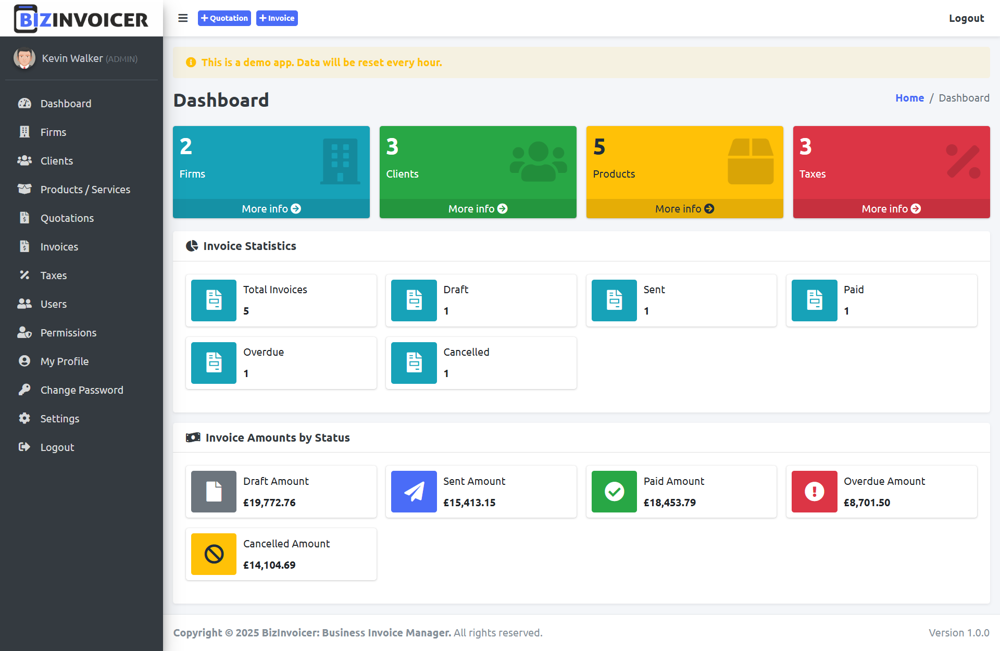
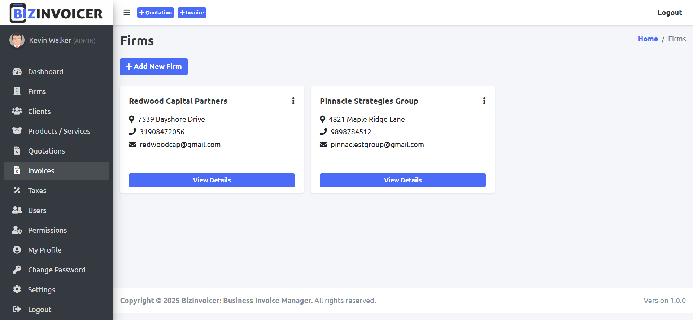
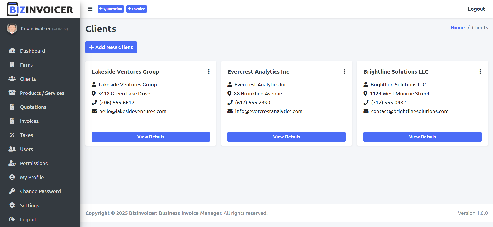
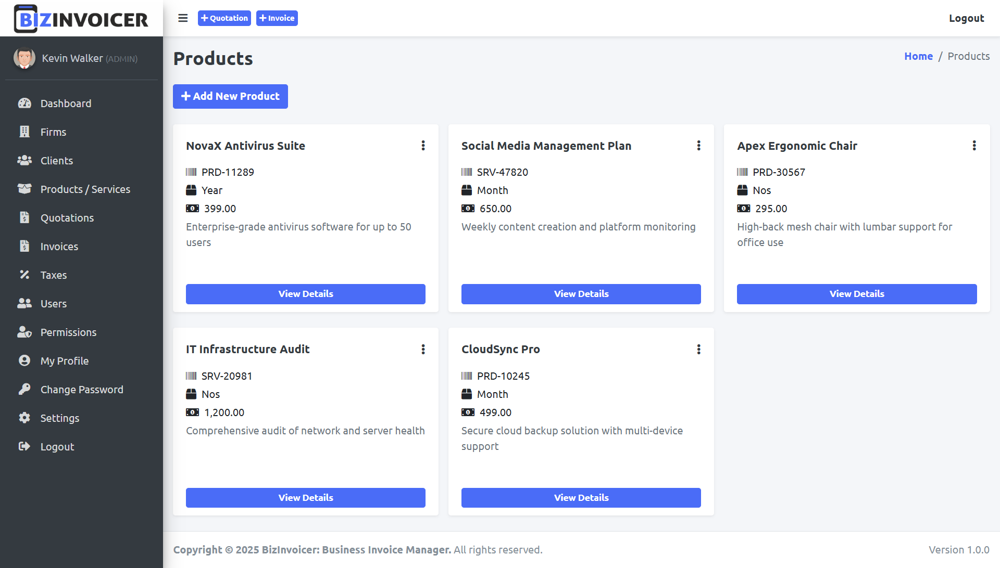
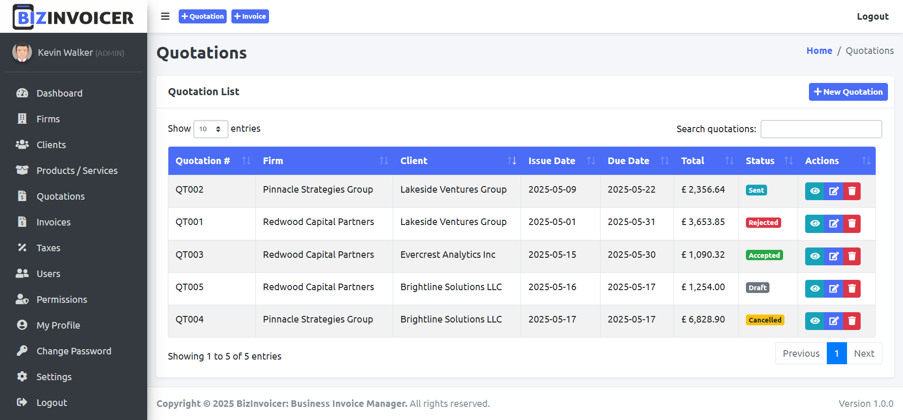
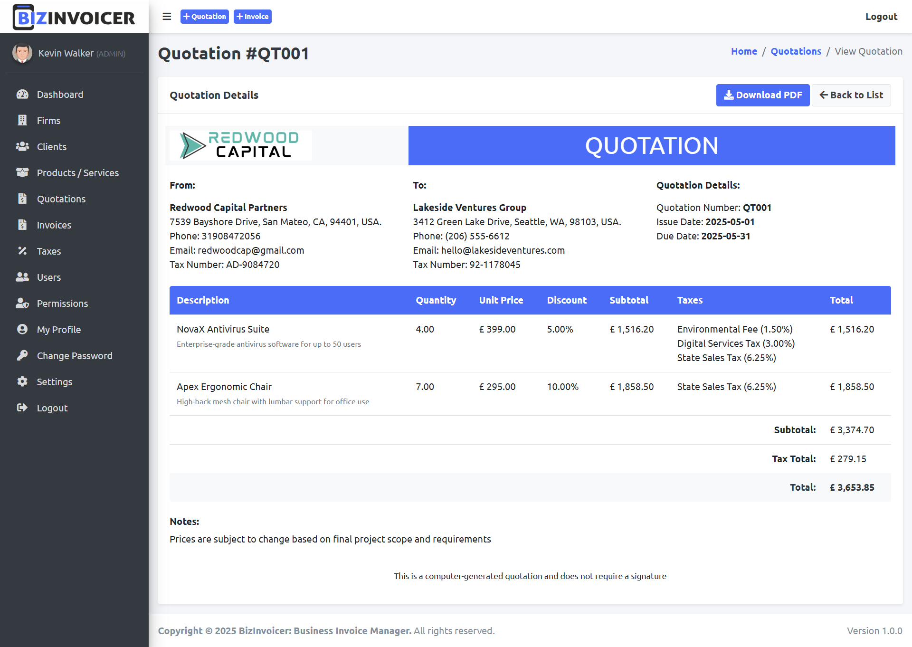
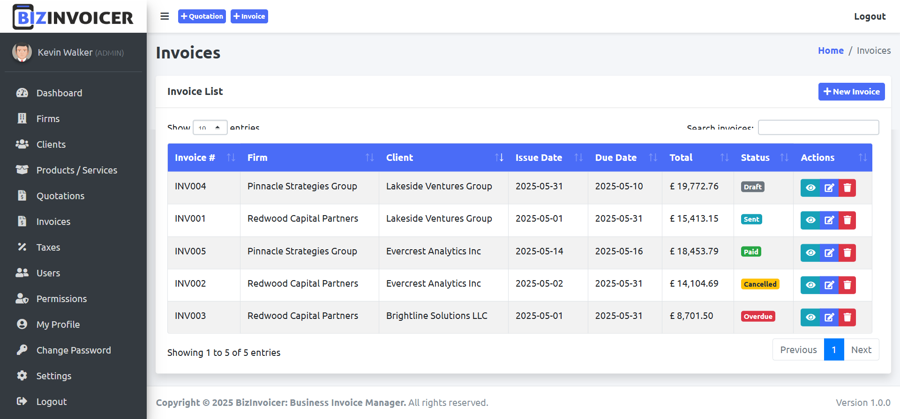
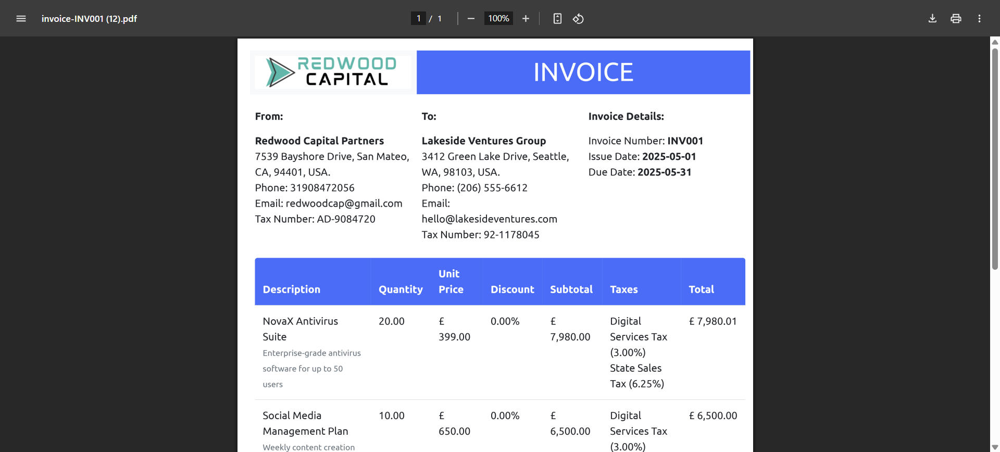
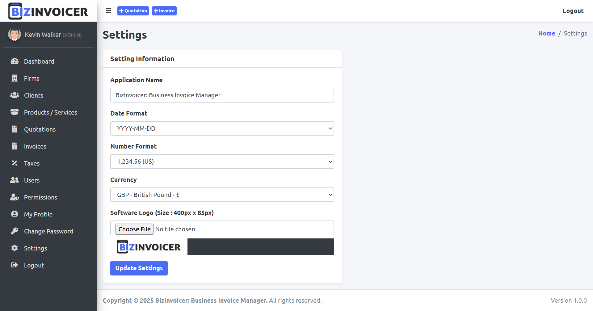

# 🚀 BizInvoicer - Professional Invoice Management System

<div align="center">


[](https://opensource.org/licenses/MIT)
[](http://makeapullrequest.com)
[](https://github.com/parshavshah/invoicebuilder/stargazers)
[](https://github.com/parshavshah?tab=followers)

A powerful, modern, and feature-rich invoice management system built with Node.js, Express, and MySQL.

[Features](#features) • [Installation](#installation) • [Usage](#usage) • [Documentation](#documentation) • [Support](#support)

</div>

## ✨ Features

- 🔐 **Secure Authentication & Authorization**

  - Role-based access control
  - Session management
  - Secure login system

- 🏢 **Firm Management**

  - Multiple business profiles
  - Custom branding options
  - Professional business details

- 👥 **Client Management**

  - Comprehensive client database
  - Client history tracking
  - Interaction management

- 📦 **Product Management**

  - Product catalog
  - Dynamic pricing
  - Inventory tracking

- 📄 **Invoice Generation**

  - Professional PDF invoices
  - Customizable templates
  - Real-time status tracking

- 💰 **Quotation System**

  - Create detailed quotations
  - Convert to invoices
  - Track quotation status

- 📊 **Tax Management**
  - Configurable tax rates
  - Automated tax calculations
  - Tax reporting

## 📸 Screenshots

<div align="center">
  <h3>Dashboard</h3>
  
  
  <h3>Firm Management</h3>
  
  
  <h3>Client Management</h3>
  
  
  <h3>Product Management</h3>
  
  
  <h3>Quotations</h3>
  
  
  
  <h3>Invoices</h3>
  
  
  
  
  <h3>Settings</h3>
  
</div>

## 🛠️ Installation

1. **Clone the repository**

   ```bash
   git clone https://github.com/parshavshah/invoicebuilder.git
   cd invoicebuilder
   ```

2. **Install dependencies**

   ```bash
   npm install
   ```

3. **Configure environment**

   - Copy `.env.example` to `.env`
   - Update database credentials
   - Set your session secret

4. **Initialize database**

   ```bash
   npm run database-init
   ```

5. **Add demo data (optional)**

   ```bash
   node ./bin/demo
   ```

6. **Start the application**
   ```bash
   npm start
   ```

## 🚀 Quick Start

```javascript
// Example configuration
{
    "development": {
        "username": "DB_USERNAME",
        "password": "DB_PASSWORD",
        "database": "DB_NAME",
        "host": "DB_HOST",
        "dialect": "mysql"
    }
}
```

## 🛡️ Security Features

- Password hashing with bcryptjs
- Session-based authentication
- HTTP security headers
- SQL injection protection
- XSS protection
- CSRF protection

## ⭐ Show your support

Give a ⭐️ if this project helped you!

## 👥 Follow Me

- GitHub: [@parshavshah](https://github.com/parshavshah)
- LinkedIn: [Parshav Shah](https://linkedin.com/in/parshavshah)

## 🙏 Credits

This project is built using several amazing open-source libraries and frameworks:

- [AdminLTE](https://adminlte.io/) - Admin dashboard template & UI framework
- [SweetAlert2](https://sweetalert2.github.io/) - Beautiful, responsive, customizable replacement for JavaScript's popup boxes
- [Sequelize](https://sequelize.org/) - Promise-based Node.js ORM
- [Express.js](https://expressjs.com/) - Fast, unopinionated, minimalist web framework for Node.js
- [MySQL](https://www.mysql.com/) - Open-source relational database management system
- [Node.js](https://nodejs.org/) - JavaScript runtime built on Chrome's V8 JavaScript engine

Special thanks to all the contributors and maintainers of these amazing projects!

## 📝 License

This project is licensed under the MIT License - see the [LICENSE](LICENSE.txt) file for details.

---

<div align="center">
Made with ❤️ by [Parshav Shah](https://github.com/parshavshah)
</div>
